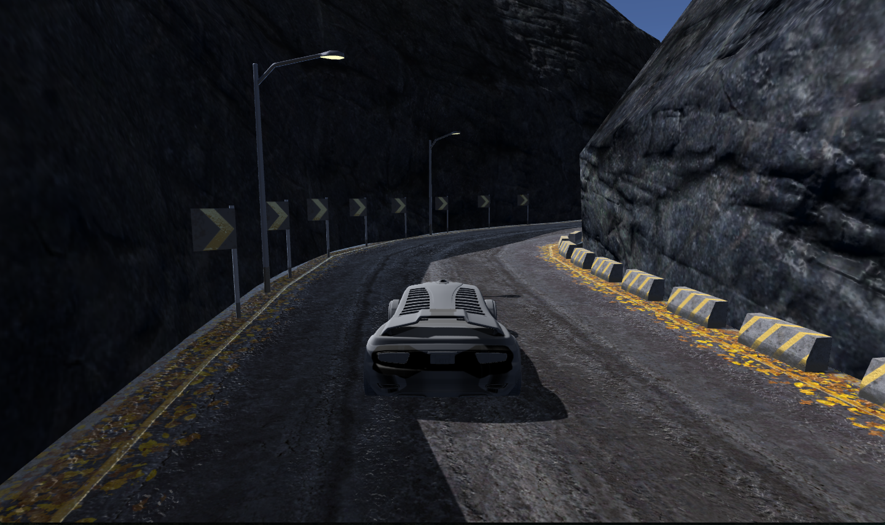

# Use Deep Learning to Clone Driving Behavior

[//]: # (Image References)
[image1]: ./examples/final-architecture.png "Final Architecture"
[image2]: ./examples/center-lane-driving.jpg "Center Lane Driving"
[image3]: ./examples/recovery-part-1.jpg "Recovery Image"
[image4]: ./examples/recovery-part-2.jpg "Recovery Image"
[image5]: ./examples/recovery-part-3.jpg "Recovery Image"
[image6]: ./examples/flipped-1.jpg "Normal Image"
[image7]: ./examples/flipped-2.jpg "Flipped Image"


## Overview

This repo contains the code written to complete the third project on [Udacity Self-Driving Car Nanodegree Program](https://www.udacity.com/course/self-driving-car-engineer-nanodegree--nd013) (Term 1). This project uses convolutional neural networks to clone a drivers behavior in a race track simulation.

## Required Files

My project includes the following files:
* [model.py](model.py) containing the script to create and train the model
* [drive.py](drive.py) for driving the car in autonomous mode
* [model.h5](model.h5) containing a trained convolution neural network 
* [Writeup.md](Writeup.md) summarizing the results
* [video.mp4](video.mp4) video recording of my vehicle driving autonomously around the track without leaving the road

## Quality of Code

Using the Udacity provided simulator and my [drive.py](drive.py) file, the car can be driven autonomously around the track by executing the following command:
```sh
python drive.py model.h5
```

The [model.py](model.py) file contains the code for training and saving the convolution neural network. The file shows the pipeline I used for training and validating the model, and it contains comments to explain how the code works.

The code uses a generator ([model.py lines 125-127](model.py#L125-L127)) for memory-efficiency. Instead of storing the preprocessed data in memory all at once, using a generator we can pull pieces of the data and process them on the fly only when we need them, which is much more memory-efficient.

## Model Architecture and Training Strategy

The final model architecture ([model.py lines 65-84](model.py#L65-L84)) consists of a convolution neural network based on the architecture described in this [NVIDIA paper](https://arxiv.org/pdf/1604.07316.pdf).

The convolutional layers are designed to perform feature extraction. NVIDIA used strided convolutions in the first three convolutional layers with a 2×2 stride and a 5×5 kernel, and a non-strided convolution with a 3×3 kernel size in the final two convolutional layers.

Due to irrelevant image content, the image data is cropped from the top by 70 pixels and from the bottom by 25 pixels ([model.py line 70](model.py#L70)). The data is normalized in the model using a Keras lambda layer ([model.py line 71](model.py#L71)). The model includes RELU layers to introduce nonlinearity ([model.py lines 72-76](model.py#L72-L76)).

The model summary including output shapes and number of parameters per layer is as follows:

| Layer           | Output Shape   | # of Params |
|:----------------|:--------------:|------------:|
| Input           | 160x320x3      | 0           |
| Cropping2D      | 65x320x3       | 0           |
| Lambda          | 65x320x3       | 0           |
| Convolution2D   | 31x158x24      | 1,824       |
| Convolution2D   | 14x77x36       | 21,636      |
| Convolution2D   | 5x37x48        | 43,248      |
| Convolution2D   | 3x35x64        | 27,712      |
| Convolution2D   | 1x33x64        | 36,928      |
| Flatten         | 2,112          | 0           |
| Dropout         | 2,112          | 0           |
| Dense           | 100            | 211,300     |
| Dropout         | 100            | 0           |
| Dense           | 50             | 5,050       |
| Dense           | 10             | 510         |
| Dense           | 1              | 11          |

|                                      |         |
|:-------------------------------------|--------:|
| **Total # of Params:**               | 348,219 |
| **Total # of Trainable Params:**     | 348,219 |
| **Total # of Non-trainable Params:** | 0       |

The model contains dropout layers in order to reduce overfitting ([model.py lines 78](model.py#L78) and [80](model.py#L80)). In addition to that, the model was trained and validated on different data sets to ensure that the model was not overfitting ([model.py lines 110-118](model.py#L110-L118)). The model was tested by running it through the simulator and ensuring that the vehicle could stay on the track.

The model used an adam optimizer, so the learning rate was not tuned manually ([model.py line 124](model.py#L124)).

Training data was chosen to keep the vehicle driving on the road. I used a combination of center lane driving, recovering from the left and right sides of the road, and doing the same in the opposite direction.

## Architecture and Training Documentation

The overall strategy for deriving a model architecture was to start with a well-known architecture found in scientifical papers. My first step was to use a convolution neural network model similar to the [NVIDIA architecture](https://arxiv.org/pdf/1604.07316.pdf). This architecture has already been used for End-to-End Deep Learning in Self-Driving Cars.

At the same time, I introduced some data augmentation into the system. First, I added a flipped version of every input image to the dataset ([model.py line 28-41](model.py#L28-L41)). In addition to that, the left and right camera images where introduced with a correction factor on the angle to help the car go back to the lane ([model.py line 57-61](model.py#L57-L61)).

In order to gauge how well the model was working, I split my image and steering angle data into a training and validation set. I found that the model had quiet balanced and low mean squared errors on the training set and on the validation set. This implied that the model was pretty well fitted.

The final step was to run the simulator to see how well the car was driving around track one. There were a few spots where the vehicle fell off the track. To improve the driving behavior in these cases, I changed the color space of each image as follows:

```
image = cv2.cvtColor(image, cv2.COLOR_BGR2RGB)
```

At the end of the process, the vehicle is able to drive autonomously around the track without leaving the road.

The final model architecture is shown in the following image:

![Final Architecture][image1]

To capture good driving behavior, I first recorded two laps on track one using center lane driving. Here is an example image of center lane driving:

![Center Lane Driving][image2]

I then recorded the vehicle recovering from the left side and right sides of the road back to center so that the vehicle would learn to navigate back onto the road. These images show what a recovery looks like starting from the right edge of the track:

![Recovery Image][image3]
![Recovery Image][image4]
![Recovery Image][image5]

To augment the data sat, I also flipped images and angles thinking that this would double the dataset. For example, here is an image that has then been flipped:

![Normal Image][image6]
![Flipped Image][image7]

I finally randomly shuffled the data set and put 20% of the data into a validation set. 

I used this training data for training the model. The validation set helped determine if the model was over or under fitting. The ideal number of epochs was five. I used an adam optimizer so that manually training the learning rate wasn't necessary.
